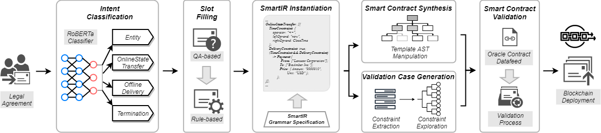

# ContractSyn

## Introduction

The Pandemic has fundamentally shaped many aspects ofour lives. One significant example is the ever-growing digi-tal transformation for virtually every type of business, suchas online courses, online conferencing, online medical andpharmaceutical systems, remote work forces, and so on.
Similarly, the legal sector is experiencing online transformation. To enable profound digital
transformation of legal agreement, ContractSyn is the first system that synthesizes blockchain-executable
smart contracts that honor the semantics of legally binding agreements.

## Requirements
<ol>
<li>Python 3.7</li>
<li>Node v12.18.1</li>
<li>npm v6.14.5</li>
</ol>

## Input
A legal agreement containing the following types of "programmable clauses". 

* Entity, e.g.,
    ```
    THIS STOCK PURCHASE AGREEMENT (this “Agreement”) is made and entered into on February 6th, 2012 (the “Execution Date”) by and among BioAmber Inc., a Delaware corporation (the “Company”), and Lanxess Corporation, a Delaware corporation (the “Purchaser”).
    ```
* OnlineStateTransfer, e.g.,
    ```
    At the Closing (as defined below), the Company shall sell and issue to the Purchaser, and, subject to the terms and conditions set forth herein, the Purchaser shall acquire and purchase from the Company, 10,030 Securities (as defined below) upon payment by the Purchaser of a purchase price of Nine Million Nine Hundred Ninety-Nine Thousand Nine Hundred and Ten US Dollars (US$9,999,910) (the “Purchase Price”), payable as set out in Section 2 of this Agreement.
    ```

* OfflineDelivery, e.g.,
    ```
    At the Closing, subject to the terms and conditions hereof, the Company shall deliver to the Purchaser the following:
    (a) ... (b) ... (c)... (d)... (e)... (f)... (g)... (h)...
    At the Closing, subject to the terms and conditions hereof, the Purchaser shall pay the Purchase Price by wire transfer of immediately available funds to an account designated in writing by the Company not less than two business days prior to the Closing and shall deliver to the Company the following:
    (a) ... (b) ... (c) ... (d)...
    ```

* Termination, e.g.,
    ```
    This Agreement may be terminated by the Purchaser in the event that all of the conditions set forth in this Section 6 (other than this Section 6.7) do not occur on or before February 8th, 2012 and, upon such termination by the Purchaser, this Agreement shall become null and void, and there shall be no liability or obligation on the part of the Purchaser or its respective officers, directors, stockholders or affiliates.
    ```

Note that ContractSyn is not limited to any specific legal agreements. We use these types of programmable clauses as the initial programming model of ContractSyn, which is extensible to support other types of clauses when necessary.

## Output
Smart contract which reflects the semantic requirements

## Setup
1. download and unzip [roberta-classification.zip](https://drive.google.com/file/d/1lC1kMeUqHQxkUuT_tuXnIVBdmzjVfo6t/view?usp=sharing), and assign the path to the variable CLASSIFIER_PATH in the file project_global_value.
2. download and unzip [QA models](https://drive.google.com/drive/folders/1DZBVHkmwYkjyKqEfRZRy-vHRJ_Df9A0I?usp=sharing), and assign the path to the variable TRAINED_QA_MODEL_PATH in the file project_global_value.
3. install the required packages and StanfordCorenlp pipeline

## How to run

### Step 1 - Instantiate SmartIR
First, users should generate the smartIR. To generate smartIR, users should execute
pipline_for_contract with three input parameters: legal agreement location, output location and its category.
The valid value of category are cc, ea, ic, pma, rrc, secpa, ta and mini, which represent the 7 contract category evaluated by ContractSyn and mini-bench used in the evaluation.
After this execution, the res folder contains the four types programmable clauses and smartIR.

    python3 pipline_for_contract.py contract_path output_path

### Step 2 - Smart Contract Synthesis

After the smartIR for a legal agreement is generated, it is ready to synthesize the corresponding target smart contract. The code for synthesis process are placed under folder `synthesis/`. Please install dependencies first:

```bash
cd synthesis
npm install
```

A typical example showing how to pipe the synthesis process is `synthesis/test/batch_eval.js`, which actually generates the evaluation dataset for us. You can run it with:

```bash
cd synthesis/test/
node batch_eval.js
```

### Step 3 - Smart Contract Validation

The smart contract validation module automatically extract the operation constraints from SmartIR, construct validation cases and validate the synthesized smart contracts. Our validation module is powered by the Truffle suite. So please first install Truffle.

```bash
npm install truffle -g
```

The command to run the simplest validation example:

```bash
cd validation/test
truffle develop
test singleValidate.js
```

## Example
We provide contracts used in our evaluation. Users can utilize these contract
as the test input to verify the installation of ContractSyn. These contracts are 
in the folder synthesis/test/test_case/. 
Smart contracts generated by ContractSyn are also in the same folder.
