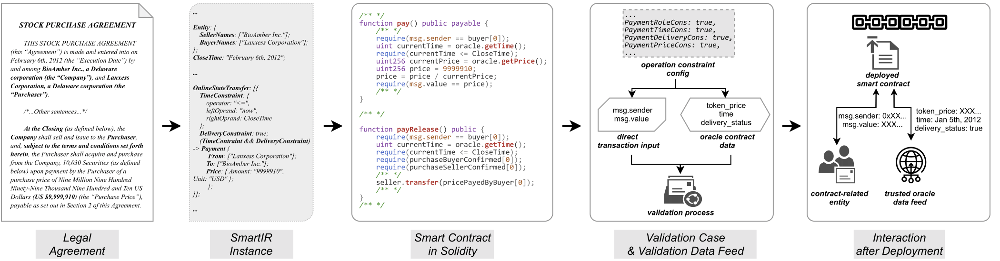

# iSyn

## 1 Introduction

The Pandemic has fundamentally shaped many aspects of our lives. One significant example is the ever-growing digital transformation for virtually every type of business, such as online courses, online conferencing, online medical and pharmaceutical systems, remote work forces, and so on.
Similarly, the legal sector is experiencing online transformation. To enable profound digital
transformation of legal agreement, iSyn is the first system that synthesizes blockchain-executable
smart contracts that honor the semantics of legally binding agreements.

## 2 An End-to-End Example

We present an overview of iSyn using an end-to-end illustrative example in the following figure. 



### 2.1 Intent Definition 
Financial agreements written by legal professionals are not originally meant to be translated into software code. Thus, the very first step in iSyn is to decide the proper programming model of legal agreements. We abstract four types of intents in our model to represent the core transaction logic in the legal agreements, as driven by our empirical study. In the example, we highlight a payment intent between two entities once certain conditions are satisfied. 

### 2.2 SmartIR Construction
SmartIR is our critical design to bridge the gap between the financial agreements written in natural languages and software code written in turing-complete programming languages. On the one hand, the intents expressed in legal agreements are automatically extracted in structured SmartIR instances, underpinned by rigorous grammar rules. On the other hand, the formal specification of SmartIR instances provides a well-defined scope for program synthesis. 
In this example, the payment intent is translated into a SmartIR item called *OnlineStateTransfer* with two constraints representing the conditions defined in the legal agreement. Internally, the above procedure is accomplished using our synergistic pipeline that unifies multiple NLP techniques. 

### 2.3 SmartIR Ambiguity Resolution with Knobs
To embrace ambiguities in legal agreements, for each SmartIR item, iSyn provides the top-5 candidates sorted based on NLP confidence scores. The top-1 candidate is by default presented in the concrete SmartIR instance generated by iSyn. All stakeholders may choose to manually inspect the SmartIR instance and alter it using our knobs to select other more appropriate candidates. Once the SmartIR instance is agreed, the subsequent process requires no human intervention. As shown in our experimental results, iSyn identifies the correct SmartIR items in the top-5 candidates with probability higher that 90%. 


### 2.4 Smart Contract Synthesis
The final blockchain-executable smart contracts are synthesized based on the SmartIR instances, predefined smart contract templates, and optional user inputs. A template essentially defines the ``backbone'' of the smart contract in form of abstract syntax tree (AST). The synthesis process then modifies, populates, or trims certain nodes of the AST, based on the SmartIR instances, to eventually output the synthesized smart contract. We employ a template-driven contract synthesis for predictability of the final smart contract.  The predictability facilitates the correctness check on the contract. 

In this example, the SmartIR items are realized by two functions in Solidity, where the critical constraints are expressed via the $require$ statements. The contract also relies on oracles to obtain authenticated offchain data, such as the delivery date of physical goods associated with the payment. 

### 2.5 Smart Contract Validation
We build a generic validation framework to verify the correctness of iSyn-synthesized smart contracts and perform automated vulnerability checks on the synthesized contracts. This framework generates comprehensive validation cases to cover all possible execution branches determined by the operation constraints extracted from the SmartIR instances. In this example, the price value and the payment time are two critical operation constraints validated by the framework. 

### 2.6 Post-deployment Interaction
The stakeholders of the legal agreements can interact with the post-deployed smart contracts as typical Ethereum smart contracts. In this example, the payer first deposits its payment into the smart contract by constructing a transaction to the $pay$ interface. Once the payment conditions are satisfied, the money is released to the payee by calling the $payRelease$ interface using the data provided by the trusted oracle.

## 3 How to Run iSyn

### 3.1 Requirements
<ol>
<li>Python 3.7</li>
<li>Node v12.18.1</li>
<li>npm v6.14.5</li>
</ol>

### 3.2 Input
A legal agreement containing the following types of "programmable clauses". 

* Entity, e.g.,
    ```
    THIS STOCK PURCHASE AGREEMENT (this “Agreement”) is made and entered into on February 6th, 2012 (the “Execution Date”) by and among BioAmber Inc., a Delaware corporation (the “Company”), and Lanxess Corporation, a Delaware corporation (the “Purchaser”).
    ```
* OnlineStateTransfer, e.g.,
    ```
    At the Closing (as defined below), the Company shall sell and issue to the Purchaser, and, subject to the terms and conditions set forth herein, the Purchaser shall acquire and purchase from the Company, 10,030 Securities (as defined below) upon payment by the Purchaser of a purchase price of Nine Million Nine Hundred Ninety-Nine Thousand Nine Hundred and Ten US Dollars (US$9,999,910) (the “Purchase Price”), payable as set out in Section 2 of this Agreement.
    ```

* OfflineDelivery, e.g.,
    ```
    At the Closing, subject to the terms and conditions hereof, the Company shall deliver to the Purchaser the following:
    (a) ... (b) ... (c)... (d)... (e)... (f)... (g)... (h)...
    At the Closing, subject to the terms and conditions hereof, the Purchaser shall pay the Purchase Price by wire transfer of immediately available funds to an account designated in writing by the Company not less than two business days prior to the Closing and shall deliver to the Company the following:
    (a) ... (b) ... (c) ... (d)...
    ```

* Termination, e.g.,
    ```
    This Agreement may be terminated by the Purchaser in the event that all of the conditions set forth in this Section 6 (other than this Section 6.7) do not occur on or before February 8th, 2012 and, upon such termination by the Purchaser, this Agreement shall become null and void, and there shall be no liability or obligation on the part of the Purchaser or its respective officers, directors, stockholders or affiliates.
    ```

Note that iSyn is not limited to any specific legal agreements. We use these types of programmable clauses as the initial programming model of iSyn, which is extensible to support other types of clauses when necessary.

### 3.3 Output
Smart contract which reflects the semantic requirements

### 3.4 Setup
1. download and unzip [roberta-classification.zip](https://drive.google.com/file/d/1lC1kMeUqHQxkUuT_tuXnIVBdmzjVfo6t/view?usp=sharing), and assign the path to the variable CLASSIFIER_PATH in the file project_global_value.
2. download and unzip [QA models](https://drive.google.com/drive/folders/1DZBVHkmwYkjyKqEfRZRy-vHRJ_Df9A0I?usp=sharing), and assign the path to the variable TRAINED_QA_MODEL_PATH in the file project_global_value.
3. install the required packages and StanfordCorenlp pipeline

### 3.5 Quick Start

#### Step 1 - Instantiate SmartIR
First, users should generate the smartIR. To generate smartIR, users should execute
pipline_for_contract with three input parameters: legal agreement location, output location and its category.
The valid value of category are cc, ea, ic, pma, rrc, secpa, ta and mini, which represent the 7 contract category evaluated by iSyn and mini-bench used in the evaluation.
After this execution, the res folder contains the four types programmable clauses and smartIR.

    python3 pipline_for_contract.py contract_path output_path category

#### Step 2 - Smart Contract Synthesis

After the smartIR for a legal agreement is generated, it is ready to synthesize the corresponding target smart contract. The code for synthesis process are placed under folder `synthesis/`. Please install dependencies first:

```bash
cd synthesis
npm install
```

A typical example showing how to pipe the synthesis process is `synthesis/test/batch_eval.js`, which actually generates the evaluation dataset for us. You can run it with:

```bash
cd synthesis/test/
node batch_synthesize.js
```

#### Step 3 - Smart Contract Validation

The smart contract validation module automatically extract the operation constraints from SmartIR, construct validation cases and validate the synthesized smart contracts. Our validation module is powered by the Truffle suite. So please first install Truffle.

```bash
npm install truffle -g
```

The commands to run the simplest validation example:

```bash
cd validation
truffle develop
test test/singleValidateExample.js
```

### 3.6 Example Case
We provide contracts used in our evaluation. Users can utilize these contract
as the test input to verify the installation of iSyn. These contracts are 
in the folder synthesis/test/test_case/. 
Smart contracts generated by iSyn are also in the same folder.
